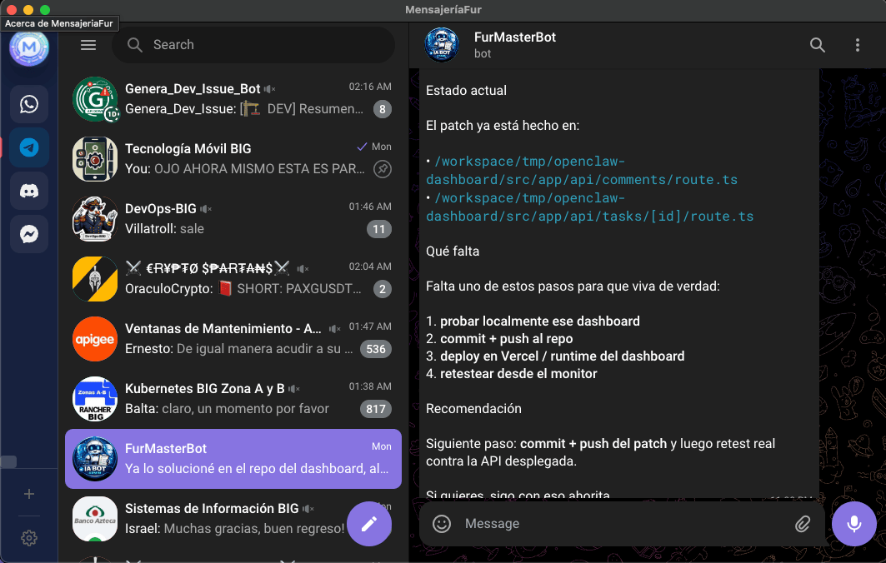

# MensajeriaFur


Aplicacion de escritorio para centralizar multiples servicios de mensajeria en una sola ventana usando Electron.

## Descarga

- Ultima release: https://github.com/furthurr/mensajeriaFur/releases/latest

## Vista previa



## Caracteristicas

- Acceso rapido a servicios como WhatsApp, Telegram, Slack, Discord, Messenger y mas.
- Soporte para multiples instancias por servicio.
- Barra lateral con orden manual de apps activas.
- Panel de ajustes con tema `claro`, `oscuro` y `sistema`.
- Modal de informacion de la app con datos del autor, redes y correo de contacto.
- Flujo de actualizacion en app con accion directa `Descargar y actualizar`.
- Auto-update en la app para macOS.
- Releases para macOS, Linux y Windows.

## Documentacion tecnica

- Documentacion detallada del proyecto: `specs/README.md`
- La carpeta `specs/` debe actualizarse cuando cambie comportamiento relevante de la app.

## Servicios compatibles

- WhatsApp
- Telegram
- Slack
- Messenger
- Discord
- Google Chat
- Microsoft Teams
- Signal
- Skype
- WeChat
- Line
- Viber
- Instagram Direct
- X / Twitter DM
- LinkedIn Messaging
- Zendesk
- Intercom
- Google Messages

## Requisitos

- Node.js
- npm
- macOS para builds locales de macOS
- Windows para builds locales de Windows
- Linux o macOS para builds locales `.deb`

## Desarrollo

```bash
npm install
npm start
```

## Build

```bash
npm run build
```

Los artefactos generados quedan en `dist/`.

Builds disponibles:

```bash
npm run build:mac:all
npm run build:linux:all
npm run build:win:x64
```

Artefactos de release actuales:

- macOS Apple Silicon: `.dmg` y `.zip`
- macOS Intel: `.dmg` y `.zip`
- Linux `amd64`: `.deb`
- Linux `arm64`: `.deb`
- Windows `x64`: `setup.exe` y `portable.exe`

## Releases automáticas

El repositorio incluye un workflow de GitHub Actions que:

- compila la app en macOS, Linux y Windows
- genera artefactos por arquitectura y plataforma
- publica los archivos en una release cuando se crea un tag `v*`

Ejemplo:

```bash
git tag v1.0.1
git push origin v1.0.1
```

Notas:

- En GitHub Actions el build de macOS puede salir sin firma ni notarizacion si no se configuran certificados y credenciales de Apple.
- El build de Windows se publica sin firma si no se configuran credenciales de code signing.
- El auto-update se mantiene como flujo soportado para macOS.

## Autor

Pedro G. V. `@furthurr`

- GitHub: https://github.com/furthurr
- Email: pedrogvas@gmail.com

## Licencia

Apache-2.0
